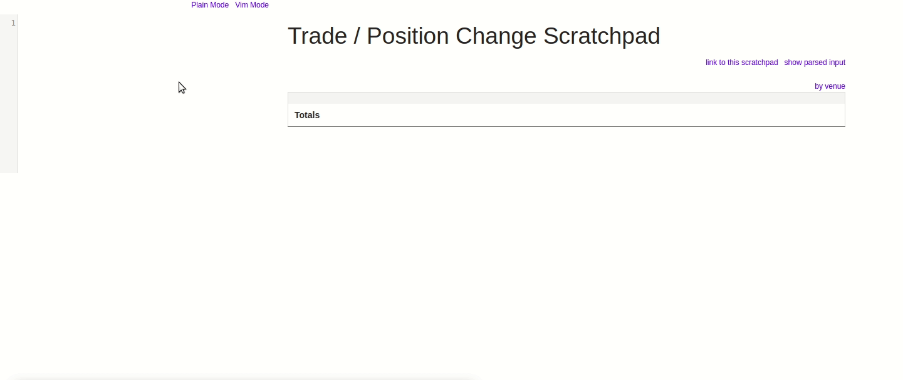

# trade-repl

Scratchpad for calculating exposures resulting from different trades.

Check it out [here](http://matthewdowney.github.io/trade-repl).



## Syntax

The [core.cljs](src/trade_repl/core.cljs) code (the whole things is just one namespace) attempts 
to parse everything you type into the input box as one of three things:

1. An instruction to evaluate Clojurescript code,
    ```clojure
    ;; Must be a comment line (1 or more leading ;) and then a single-line expression
    ; (let [x "Eval me!"] (js/alert x)) => nil
    ;; As soon as you type "=>" and space it evaluates
    ```
    
2. some sort of trade (buy/sell something with something else at some price), or
    ```clojure
    ;; (Case insensitive) Buy <qty> <thing> @ <price> <price unit>
    Buy 1 WIDGET @ 10 USD  

    ;; Simple buy / sell with fees & venues:
    ;; [Buy|Sell|Short|Long] qty thing @ price price-unit [[with|after] [fee|inverse fee] of x] [on trading-venue]
    Short 10 JPY @ 0.0094 USD with fee of 0.10% ;; Fee 10 basis points
    Short 10 JPY @ 0.0094 USD with fee of 0.001 ;; Fee 10 basis points (as a decimal)
    Short 10 JPY @ 0.0094 USD after fee of 0.001 ;; A trade executing @ 0.0094 *after* the 10 bp fee
 
    ;; An inverse fee is charged against the base currency iff you are buying.
    ;; So here the fee would be 0.10% of the JPY bought.
    Long 10 JPY @ 0.0094 USD with inverse fee of 0.10%

    Long 10 JPY @ 0.0094 USD on TSE ;; All entries like this will be grouped by venue (TSE in this case)
    
    ;; Buy sell in terms of how much counter currency to spend, rather than qty
    ;; [Buy|Sell|Short|Long] trade-amount price-unit of base-unit/price-unit @ price
    Short 10 USD of JPY/USD @ 0.0094

    ;; Futures
    ;; Instead of base/counter use BASE/SETTLE_MONTH_SYMBOL_YY
    Short 10 USD of JPY/USD_U19 @ 0.0094 ;; Short 10USD of the september futures
    Short 100 JPY/USD_U19 @ 0.0094 ;; Short 100JPY of the september futures
    ```
3. an instruction to group the trades on subsequent lines under some name.
    ```clojure
    ;; A (group ...) declaration must be alone on a line
    ;; default group is t = 0 for the first trade, then t = 1, etc.
    (group Short trades)	
    Short 10 JPY @ 0.0094 USD with fee of 0.10% ;; Fee 10 basis points
    Short 10 JPY @ 0.0094 USD with fee of 0.001 ;; Fee 10 basis points (as a decimal)
    Short 10 JPY @ 0.0094 USD after fee of 0.001 ;; A trade executing @ 0.0094 *after* the 10 bp fee

    (group Long trades)
    Long 10 JPY @ 0.0094 USD with fee of 0.10% ;; Fee 10 basis points
    Long 10 JPY @ 0.0094 USD with fee of 0.001 ;; Fee 10 basis points (as a decimal)
    Long 10 JPY @ 0.0094 USD after fee of 0.001 ;; A trade executing @ 0.0094 *after* the 10 bp fee
    ```
    
Uses a bit of a hack for the github pages display: compiling with
```clojure
lein do clean, cljsbuild once min, gh-pages
```
compiles to the `resources/public` directory and then copies that dir into 
`docs/` so that it's found by gh pages.
